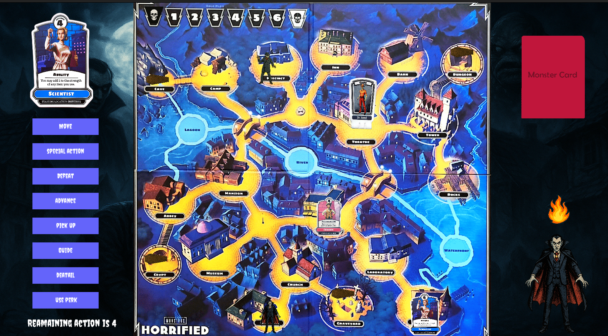
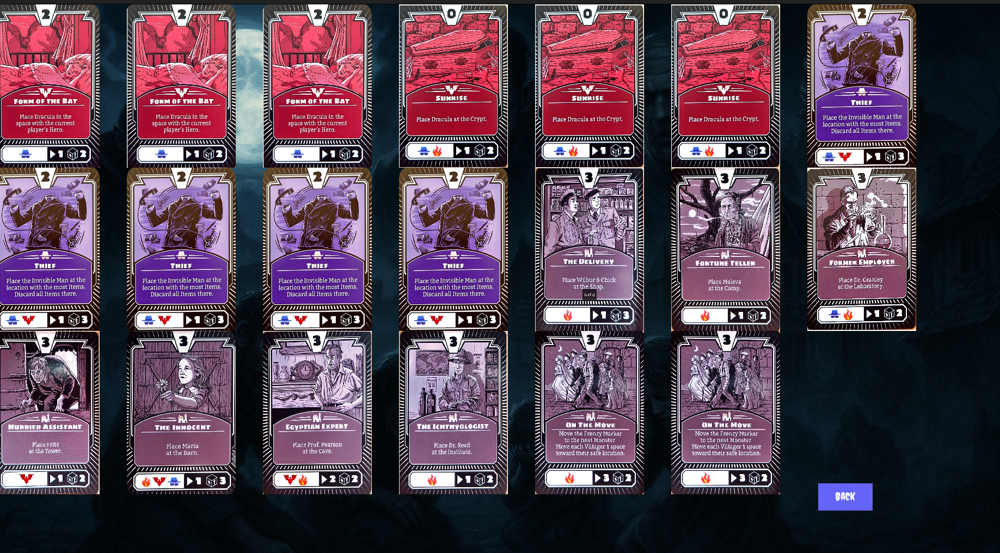
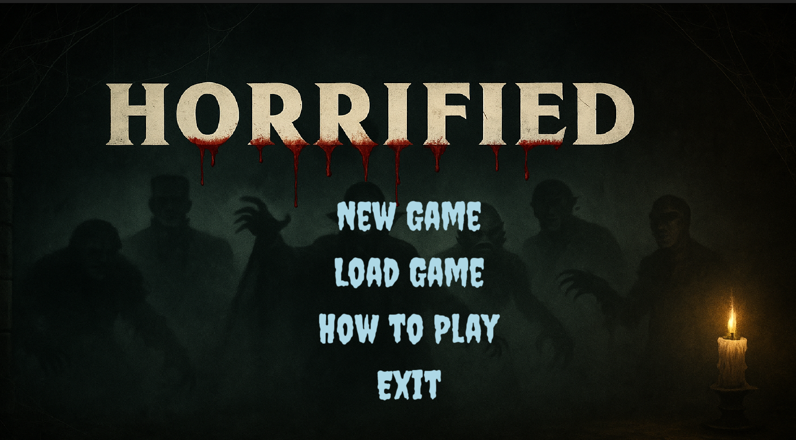

# 🎲 Horrified Board Game 👻

> A thrilling cooperative terminal-based board game adventure where heroes battle classic monsters to save a small town!

<p align="center">
  
  
  
</p>

---

## 🎮 About the Game

**Horrified** is an immersive cooperative board game experience that brings classic horror monsters to life in your terminal. Players take on the roles of heroic characters racing against time to save a small town from legendary creatures like Dracula, The Invisible Man, and other iconic monsters.

### 🖼️ Game Screenshots

#### 🎯 Main Menu


_The atmospheric main menu featuring the game title with blood-like drips and shadowy monster figures_

#### 🗺️ Game Board


_The interactive game board showing locations, characters, and the terror track_

#### 🃏 Monster Cards


_Collection of monster action cards that dictate game events and monster behavior_

### 🎯 Game Features

- **🏃‍♂️ Cooperative Gameplay:** Work together with up to 5 players to defeat monsters before they unleash chaos
- **👹 Dynamic Monster AI:** Each monster has unique abilities and behavior patterns that adapt throughout the game
- **🗺️ Modular Map System:** Explore a town with multiple locations, each offering different strategic opportunities
- **⚔️ Hero Abilities & Items:** Choose from various heroes with special powers and collect items to enhance your capabilities
- **🎲 Perk System:** Unlock and use special perks that provide strategic advantages
- **💾 Save/Load System:** Save your progress and continue your adventure later
- **🎵 Audio Experience:** Immersive sound effects and background music
- **🎨 Rich Visual Assets:** Beautiful graphics and animations using SFML

### 🎪 Game Mechanics

- **Turn-Based Strategy:** Plan your moves carefully as each action counts
- **Resource Management:** Collect and manage items, perks, and abilities
- **Monster Frenzy:** Monsters become more dangerous as the game progresses
- **Location-Based Actions:** Different locations offer unique opportunities and challenges
- **Villager Rescue:** Protect innocent townspeople from monster attacks

---

## 🛠️ Prerequisites

Before building the game, ensure you have the following installed:

- **C++20 compatible compiler** (GCC 10+ or Clang 12+)
- **CMake 3.11 or higher**
- **SFML 2.5+** (Graphics, Window, System, and Audio modules)
- **Linux OS** (recommended for best compatibility)

### 📦 Installing Dependencies

#### Ubuntu/Debian:

```bash
sudo apt update
sudo apt install build-essential cmake libsfml-dev
```

#### Arch Linux:

```bash
sudo pacman -S base-devel cmake sfml
```

#### Fedora:

```bash
sudo dnf install gcc-c++ cmake SFML-devel
```

---

## 🚀 Installation & Build

### 1. Clone the Repository

```bash
git clone https://codeberg.org/Ali_kermani/horrified_board_game
cd horrified_board_game
```

### 2. Build the Project

```bash
mkdir build
cd build
cmake ..
make -j$(nproc)
```

### 3. Run the Game

```bash
./app
```

---

## 🎮 How to Play

### 🎯 Basic Controls

- **Arrow Keys:** Navigate menus and move around the game
- **Enter:** Select options and confirm actions
- **Double Enter:** Execute selected actions

### 🎪 Game Setup

1. **Choose Your Hero:** Select from available characters (Archaeologist, Courier, Mayor, Scientist)
2. **Select Monsters:** Choose which monsters to face in your adventure
3. **Plan Your Strategy:** Coordinate with other players to defeat the monsters

### 🎲 Gameplay

- **Movement:** Navigate between locations on the map
- **Actions:** Perform special abilities, collect items, and fight monsters
- **Cooperation:** Work with other players to achieve victory
- **Time Management:** Complete objectives before monsters overwhelm the town

### 🏆 Victory Conditions

- Defeat all selected monsters
- Protect villagers from harm
- Complete monster-specific objectives

### 💀 Defeat Conditions

- All heroes are defeated
- Monsters achieve their sinister goals
- Town is overrun by darkness

---

## 🏗️ Project Structure

```
horrified_board_game/
├── src/                    # Source files
│   ├── main.cpp           # Entry point
│   ├── programm.cpp       # Main game logic
│   ├── hero.cpp           # Hero class implementations
│   ├── monster.cpp        # Monster class implementations
│   └── ...                # Other game components
├── include/               # Header files
│   ├── hero.hpp           # Hero class definitions
│   ├── monster.hpp        # Monster class definitions
│   └── ...                # Other headers
├── Horrified_Assets/      # Game assets
│   ├── Heros/            # Hero character sprites
│   ├── Monsters/         # Monster sprites
│   ├── Items/            # Item graphics
│   └── ...               # Other assets
├── sounds/               # Audio files
├── save1/                # Save game files
└── CMakeLists.txt        # Build configuration
```

---

## 🎭 Game Characters

### 🦸‍♂️ Heroes

- **Archaeologist:** Expert in ancient artifacts and monster lore
- **Courier:** Fast movement and delivery abilities
- **Mayor:** Leadership skills and town influence
- **Scientist:** Advanced research and item creation

### 👹 Monsters

- **Dracula:** Classic vampire with hypnotic powers
- **Invisible Man:** Stealth and surprise attacks
- **Additional monsters** with unique abilities and behaviors

### 🏘️ Villagers

- **Dr. Cranly:** Town doctor with medical knowledge
- **Dr. Reed:** Scientific expertise
- **Fritz:** Local handyman
- **Maleva:** Mysterious fortune teller
- **Maria:** Innocent town resident
- **Prof. Pearson:** Academic knowledge
- **Wilbur and Chick:** Local farmers

---

## 🛠️ Development

### 🔧 Building for Development

For development with VS Code, create a `.vscode/c_cpp_properties.json` file:

```json
{
  "configurations": [
    {
      "name": "Linux",
      "compileCommands": "${workspaceFolder}/build/compile_commands.json",
      "includePath": [
        "${workspaceFolder}/include",
        "${workspaceFolder}/src",
        "/usr/include/SFML"
      ],
      "defines": [],
      "compilerPath": "/usr/bin/g++",
      "cStandard": "c11",
      "cppStandard": "c++20",
      "intelliSenseMode": "linux-gcc-x64"
    }
  ],
  "version": 4
}
```

### 🐛 Debugging Tips

- Use `Ctrl+Shift+P` and reset IntelliSense database if needed
- Check console output for error messages
- Verify SFML installation with `pkg-config --modversion sfml-all`

---

## 📊 UML Diagram

View the complete class diagram and architecture:
[UML Diagram](https://www.plantuml.com/plantuml/png/bLTTSzIy5RxVNw616Uga2KE0yE6132b92XTCEmtJMuyidrshAqiUITxWqFxtIhBsH5fitZTSx72Uy_XywqZvP2pLTkZ4ocovxAcc7M626aD-hWZv9sqQBZVax8KJlb6zuPASdRl_NsgjxcwKjBVy7iZPImSzIA-TT6j1Wx9Z3pdhRvHjDreDilciXDBawStLpPlhLrwZT0CwekVlti3RyzN_3gEwj5RpUh3mbIaPhBwO3VoBqlpUEQRYjgVCft3kK_WtQCjP2ZeNgx-GZuV_oBKSElChlWA7auxsPy4D8QqoFNTko4SNYGSsckwW6gbk77GM8DOEchLEV1b4BetbrkNWa5S14RHMcbgbHmUz3f1fLU-4yo1qWu6XS-ARoPuUUskT-3Q8jAx1V_Xkub9fk99EVXzasmAr6dmmKu1MtO7suXHSezZMU74VdFJ255UlmPM9MOzCOTLK1_qKLpF83QW0nCXSxbvw6wMkzzAxfI9_zls2kJBJsbXDcOqjRK6hMF2dH2XM-XzgNPx74QJCIwMBtqQ4M-YgrWLKaXqmg_G7ZnnVH7KFUfkhFO9gIJkerBhodalYWd7ZiWgwlnBJ0-DKL9FFegCzsjXxalRYuiG7YHeC-E8ecg7DZae6HQUaiQ0DKYDmx2pKmwOalLORJRjk_-5cu0qikvt_g84rKFjuPvtQGP6NV2aiiFkI764ZVBaSxcjhYl1xK6_y6bb71undYHtVGbE4twojYHra7UKCjDDpjXtwuWZDOjZ94ANcNEBU6EQVgFnuL7vMF25EYHlsW_7rUP2VyJFFHYvQEZGIGnLqB5eGVQNg_wGLTpucqpwrQFgKzFveFvJ-DFCL8QQ4SXozgSioBDk8vosEenxC5mzcJpAB9xyQEpcmatNNcy7HM4mS5TwuusUnBZS5Iu8GbiK1bGP1iRbOYlMQomf-S6DBKYibecB7XQ0Rq9Nm6Zna4OqxuZGK9wTu1DL-DdArHr0T3rxEYA0Z9TEPnbdig1XWYZQTu7rmnQua66XAI8iGZU2SHmhcK_0o99SPm7IAjWovPTeqcw8hzzbb0v25S3W7UPP7KuQ9Ekc9ryzqvHcoqrGMjW2UtaEMnt8MffOJ8-ovE7eX68wJDtV-35r3jH_HT7xZJ0vQWxI_OT0xgfkIXDs8Kx8_Hwd3j3s7Pek5Opf7NLXzcCWIgT6ghsmBOQqxGWmPBVpntembnfkVcsgjGTwFE1qUdQ1AwGQNt-8x0U_rQ1gTJrghB1LLovi6P9YXr5x3cufQIzaske-fq9eBRiTYyVgihAfwGHaKMWtMzIUvhf-vbJfqDUxNtCYVkuImB3F79YqEdhb7Tw1Y_ZtxCtrPCJL8cvU7WKzpJC6Gle1rP4RNi0Df7_rkEl5rcIjnZD4diOMy3ITUE_FOURX1aOeNjB7E8ICT_I5zrE7r-pxg9D-qjd8cjD9fCVrky6ErZtOc_0Fct1lcW3BtNDhdF5OBvKF6xwyN965xSsQgGVhYZHRrUd2BOEcn_rKwChTKCfXvy7j3vCD_Jq_9fMOj1INKnZbAy6zqL7hbgp39jGQwzMLgr9rCy7RGUanaGIrKN5fLXUOb6hK3RQnYsmJJq8D8v1qtt9yYrLKDM62Mxs0LYpCnhZJT3eBc89V-mrg0QvDSfSMSzDURiRUSokhwX_DbPnXhfJkVdL-WDPrZt3Y60wwxNgWHz3p33XAgxo34BE7Be3M7fheqXXjBfPtZZBrKbhFgx_GUPlJ_a276JktcjBU3rDpCQRwxZrXhsp6sUe5o1SALN8yBwgzIAWPo_ciEw_bP_5TyXPYMzsPf6fMpWM_9i7aH3olGOVWtveCcZCvqrqsQ5TeupZyC9odJullXuGqtGmgkfYVOZ7O_XcMs0LOudZDPhN057kVAmws6n3ILRA6b3An5jizondoqEIVhR9c9ENk-Ecu0hg07sO1a78m_MAG3swh6J5rx_lo2F9bPf4-yCzgJdZhZO44_qD5ZYQRIi1vXClyiDnskoTKd5_hGYVy3)

---

## 🤝 Contributing

We welcome contributions! Please feel free to submit issues, feature requests, or pull requests.

### 🐛 Reporting Bugs

- Use the issue tracker to report bugs
- Include detailed steps to reproduce the issue
- Provide system information and error messages

### 💡 Feature Requests

- Describe the feature you'd like to see
- Explain how it would improve the game
- Consider implementation complexity

---

## 📝 License

This project is licensed under the **Basu University Computer Engineering Department** as an advanced programming project.

For more information, visit: [https://codeberg.org/SSCES](https://codeberg.org/SSCES)

---

## 👥 Collaborators

- 👤 **[Ali Kermani](https://codeberg.org/Ali_kermani)** - 40312358032
- 👤 **[Amin Rahimi Mehrnia](https://codeberg.org/aminrm4)** - 40312358013

---

## 🙏 Acknowledgements

- **SFML Team** for the excellent multimedia library
- **Basu University** for educational support
- **Open Source Community** for inspiration and tools

---

## 📞 Support

If you encounter any issues or have questions:

1. Check the [Issues](https://codeberg.org/Ali_kermani/horrified_board_game/issues) page
2. Review the installation requirements
3. Ensure all dependencies are properly installed
4. Contact the development team

---

**🎮 Ready to face the horrors? Start your adventure now!**
